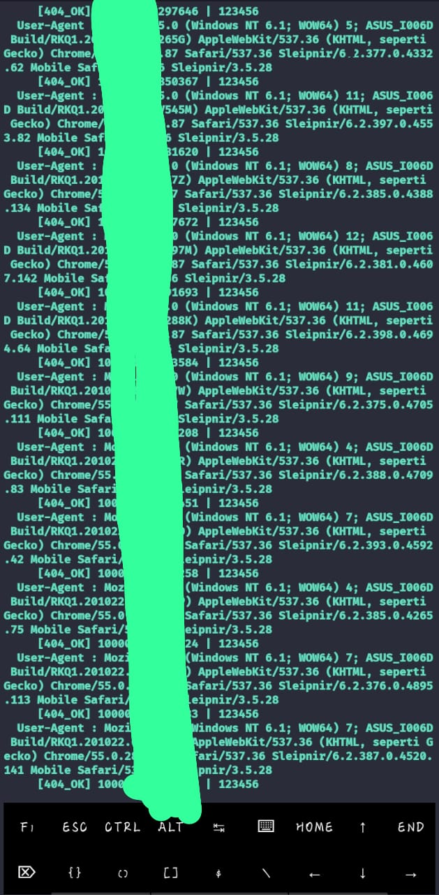

# Uid-404

# Another Random Cloning Tools 🔥

# Install Methods..

      pkg update && upgrade

          pkg install git
 
    pkg install python && python2

        pkg install git

      pip install requests

      pip install mechanize
       
       rm -rf Uid-404
git clone https://github.com/V-Virux-404/Uid-404

          cd Uid-404

       python Uid-404.py

# Okz Idzz prOoF 🔥

